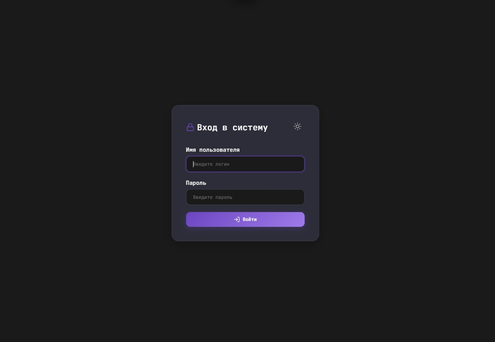
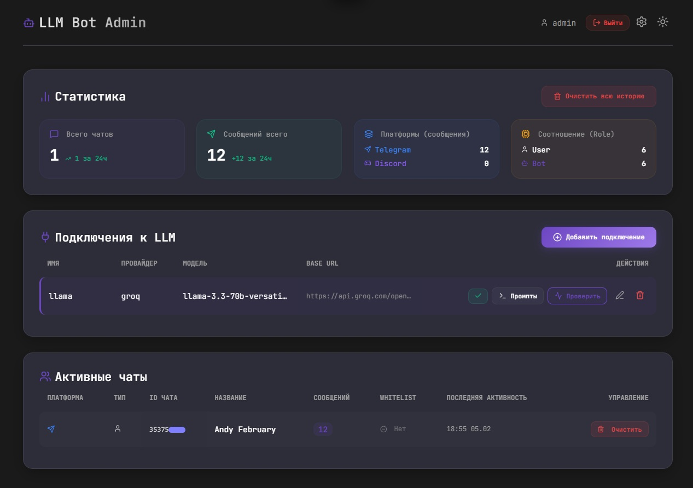
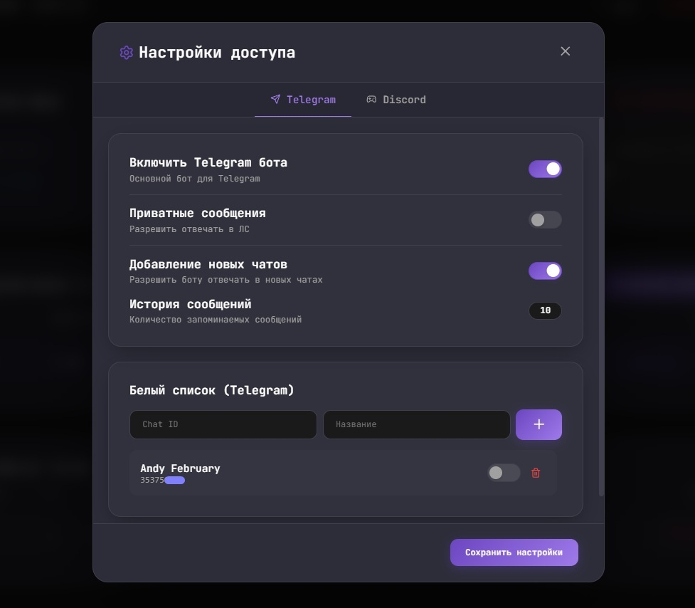
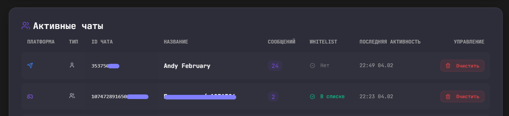
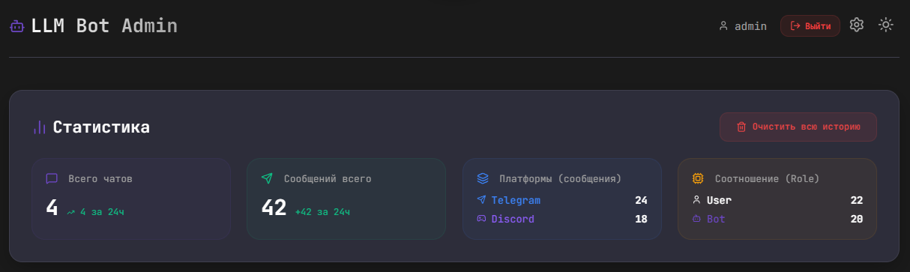

# 🤖 AI Multi-Platform Bot & Admin Panel


Это мощный мультиплатформенный бот (Telegram & Discord) с интеграцией LLM (OpenRouter, OpenAI, Groq и др.), оснащенный профессиональной панелью управления. Полностью контейнеризирован и готов к развертыванию.

---

## ✨ Основные возможности

### 🤖 Боты (Telegram & Discord)

- **Мультиплатформенность**: Одновременная работа в Telegram и Discord с общими настройками LLM.
- **Контекстное общение**: Боты помнят историю диалога (размер настраивается индивидуально для каждой платформы).
- **Поддержка множества моделей**: Переключение между моделями через админку без перезапуска.
- **Управление историей**: Команда `/clear` в Telegram для очистки истории текущего чата.
- **Интеллектуальная фильтрация**: Ответы только при упоминании (mention) в группах или в разрешенных каналах.
- **Никнеймы**: Сохранение имен пользователей в истории для более точных ответов LLM.
- **Музыкальный плеер (Discord)**: Полнофункциональный проигрыватель с поиском YouTube, очередью треков, интерактивным UI, автоматической очисткой и логикой перезапуска.
- **Справка**: Команда `/help` в Discord для быстрого доступа к списку всех команд.

### 🛠 Панель управления (Admin Panel)

- **Премиальный интерфейс**: Современный адаптивный дизайн с поддержкой Темной и Светлой темы.
- **Централизованные настройки**: Управление доступом, лимитами памяти и активностью ботов для обеих платформ.
- **Управление подключениями**: Добавление, редактирование и проверка LLM-провайдеров через UI.
- **Библиотека промптов**: Создание и активация системных промптов с привязкой к подключениям.
- **Расширенная статистика**: Мониторинг активности по платформам, ролям и времени (за последние 24 часа).
- **Белый список (Whitelist)**: Управление разрешенными группами, супергруппами (Telegram) и серверами/каналами (Discord).
- **Управление музыкальным плеером**: Включение/выключение музыкального функционала Discord бота через админ-панель.
- **Безопасность**: Защищенный вход (Cookie-based Session).

---

## 🛠 Технологический стек

- **Core**: [Python 3.11+](https://www.python.org/)
- **Web Framework**: [FastAPI](https://fastapi.tiangolo.com/)
- **SDKs**: [Aiogram 3.x](https://docs.aiogram.dev/) & [Discord.py](https://discordpy.readthedocs.io/)
- **Database / ORM**: [Tortoise ORM](https://tortoise.github.io/) + [Aerich](https://github.com/tortoise/aerich) (Миграции)
- **Database Engine**: [PostgreSQL](https://www.postgresql.org/)
- **Infrastructure**: [Docker](https://www.docker.com/) & [Docker Compose](https://docs.docker.com/compose/)
- **Reverse Proxy**: [Nginx](https://www.nginx.com/)

---

## 🚀 Быстрый старт (Docker)

### 1. Подготовка окружения

Клонируйте репозиторий и создайте файл конфигурации:

```bash
cp .env.example .env
```

### 2. Настройка `.env`

Обязательно заполните следующие поля:

- `BOT_TOKEN`: Токен Telegram бота.
- `DISCORD_BOT_TOKEN`: Токен Discord бота.
- `BASE_WEBHOOK_URL`: Публичный URL вашего сервера.
- `ADMIN_USERNAME` & `ADMIN_PASSWORD`: Учетные данные для админки.

### 3. Запуск

```bash
docker compose up -d --build
```

**После запуска:**

- Боты начнут работу (Telegram через webhook/polling, Discord в фоне).
- Админ-панель: `http://localhost/admin`.
- Логи: `./logs`.

---

## 🧪 Screenshots

<details>
  <summary>Посмотреть скриншоты</summary>

### Вход в систему

  

### Дашборд и Статистика

  

### Настройки доступа и Белый список

  

### Чаты

  

### Статистика

  

</details>

---

## ⚙️ Конфигурация (.env)

| Переменная | Описание |
|------------|----------|
| `BOT_TOKEN` | Токен Telegram бота |
| `DISCORD_BOT_TOKEN` | Токен Discord бота |
| `BASE_WEBHOOK_URL` | Публичный HTTPS адрес (для Telegram Webhook) |
| `ADMIN_USERNAME` | Логин администратора |
| `ADMIN_PASSWORD` | Пароль администратора |
| `TELEGRAM_ADMIN_IDS` | ID Telegram пользователей для управления промптами |
| `HISTORY_SIZE` | Размер истории по умолчанию |

---

## 📝 Разработка и обслуживание

- **Логи**: `docker compose logs -f bot`
- **Миграции**: Автоматически применяются при запуске через `aerich`.
- **Сброс данных**: `docker compose down -v`

---

## 📚 Документация

Подробная документация доступна в папке `docs/`:

- **[DEPLOYMENT.md](docs/DEPLOYMENT.md)** — Полное руководство по развертыванию проекта
- **[TELEGRAM_BOT.md](docs/TELEGRAM_BOT.md)** — Документация по Telegram боту
- **[DISCORD_BOT.md](docs/DISCORD_BOT.md)** — Документация по Discord боту и музыкальному плееру

---

## 📄 Лицензия

Этот проект распространяется под лицензией MIT.

---
*Developed with ❤️ as a professional Multi-Platform LLM Solution.*
